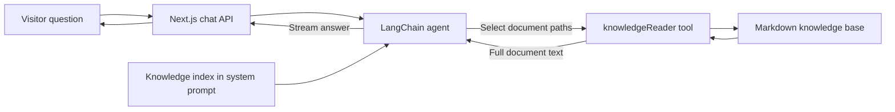

# Agent Yong — A Conversational Portfolio

Agent Yong is Yongjie Xie's AI-powered portfolio. Visitors can ask about his background, skills, work, and projects through a responsive chat interface instead of searching through a static resume. The application uses an **agentic RAG** workflow: an LLM chooses relevant documents from a Markdown knowledge base, reads them with a tool, and uses the retrieved content to answer.

## What visitors can do

- Ask follow-up questions in a conversation about experience, technical skills, education, and projects.
- Start with quick questions for an introduction, career background, projects, or skills.
- Explore individual projects in more detail, with responses streamed into the chat interface.
- Chat in the language they use; the system prompt instructs the agent to reply in that language.

## How the agentic RAG workflow works



1. **Index the available knowledge.** At agent initialization, `getSystemPrompt.ts` loads `src/assets/systemPrompt.md` and appends the body of `src/assets/knowledgeIndex.md`. The index lists document paths and short descriptions to help the model decide where to look. Those descriptions are navigation hints, not evidence for detailed claims.
2. **Choose and read documents.** The LangChain agent has one tool, `knowledgeReader`. It accepts a path from the index, such as `knowledge/projects/transider.md`, and reads that document from `src/assets/knowledge/`. The agent can read more than one document when a question spans topics.
3. **Ground the answer.** The system prompt tells the model to read full documents before stating specific facts and to say when the knowledge base does not support a claim. The retrieved text becomes context for its response.
4. **Stream the conversation.** The `/api/chat` route converts AI SDK messages into LangChain messages, streams agent output, and returns an AI SDK UI message stream to the React client.

The reader only returns Markdown files inside `src/assets/knowledge/`; it resolves paths before checking containment, including symlinks. This is **file-based, tool-directed retrieval**. There is no embedding pipeline, vector database, or similarity search in the current implementation. Tool use and factual accuracy are guided by the prompt and model behavior; the application does not guarantee a tool call on every turn or hallucination-free answers.

## Project structure

| Path | Purpose |
| --- | --- |
| `src/app/ChatContent.tsx` | Responsive chat UI, quick questions, and streamed message rendering |
| `src/app/api/chat/route.ts` | Chat endpoint and streaming bridge |
| `src/libs/agent.ts` | LangChain agent, model, and tool configuration |
| `src/libs/getSystemPrompt.ts` | Loads the system prompt and knowledge index |
| `src/libs/tools/knowledgeReader.ts` | Validates document paths and reads knowledge files |
| `src/assets/knowledgeIndex.md` | Navigation index for the agent |
| `src/assets/knowledge/` | Markdown documents for profile, experience, skills, and projects |

## Tech stack

- **Application:** Next.js 16 App Router, React 19, TypeScript, Tailwind CSS 4
- **Agent:** LangChain.js, Zod-validated tool input
- **Chat streaming:** Vercel AI SDK and `@ai-sdk/langchain`
- **Model access:** OpenRouter through `@langchain/openai`; the current model ID is configured in `src/libs/agent.ts`
- **Knowledge base:** Local Markdown files and an index loaded into the agent prompt

## Run locally

Requirements: Node.js and an OpenRouter API key.

```bash
git clone https://github.com/Mou2xie/agent_me.git
cd agent_me
npm install
```

Create `.env.local` in the repository root:

```env
OPENROUTER_API_KEY=your_openrouter_api_key
```

Then run:

```bash
npm run dev
```

Open [http://localhost:3000](http://localhost:3000). Use `npm run build` to check a production build and `npm start` to serve that build locally.

## Update the knowledge base

Edit or add a Markdown file under `src/assets/knowledge/`, then add or update its entry in `src/assets/knowledgeIndex.md` with the exact path relative to `src/assets/`. The agent uses the index to discover documents and `knowledgeReader` to read their full contents. Keep descriptions concise and put factual details in the linked document.

## Why this design

The indexed Markdown corpus keeps portfolio facts reviewable and easy to update. Giving the agent a document-reading tool lets it choose material relevant to each question instead of placing every detailed record in the prompt. The trade-off is that retrieval depends on the model selecting the right documents, and the final answer still needs normal fact checking.

Built by Yongjie Xie.
